 
## 查看主页获取源码

### 一、作品包含

源码+数据库+设计文档万字+PPT+全套环境和工具资源+部署教程

### 二、项目技术

前端技术：Html、Css、Js、Vue、Element-ui

数据库：MySQL

后端技术：Java、Spring Boot、MyBatis

  

### 三、运行环境

开发工具：IDEA/eclipse

数据库：MySQL5.7

数据库管理工具：Navicat10以上版本

环境配置软件： JDK1.8+Maven3.6.3

前端Nodejs：14

### 四、项目介绍
项目编号：springbootA261

华为数码商城交易平台，是在华为公司雄厚的技术实力和品牌信誉基础上构建的线上购物平台，它不仅承载着华为对市场需求的深刻理解和对消费者体验的持续关注，而且展现了华为在数字化转型时代的前瞻布局和坚定承诺，为用户提供了一个权威、可靠的数码产品选购空间。

前台用户功能：浏览首页、数码商品、秒杀商品、商城资讯、购物车和个人中心。

后台分为管理员和卖家
管理员的功能：首页、个人中心、卖家管理、用户管理、数码分类管理、数码商品管理、秒杀商品管理、系统管理和订单管理。
卖家的功能：首页、个人中心、数码商品管理、秒杀商品管理和订单管理。

### 五、运行截图

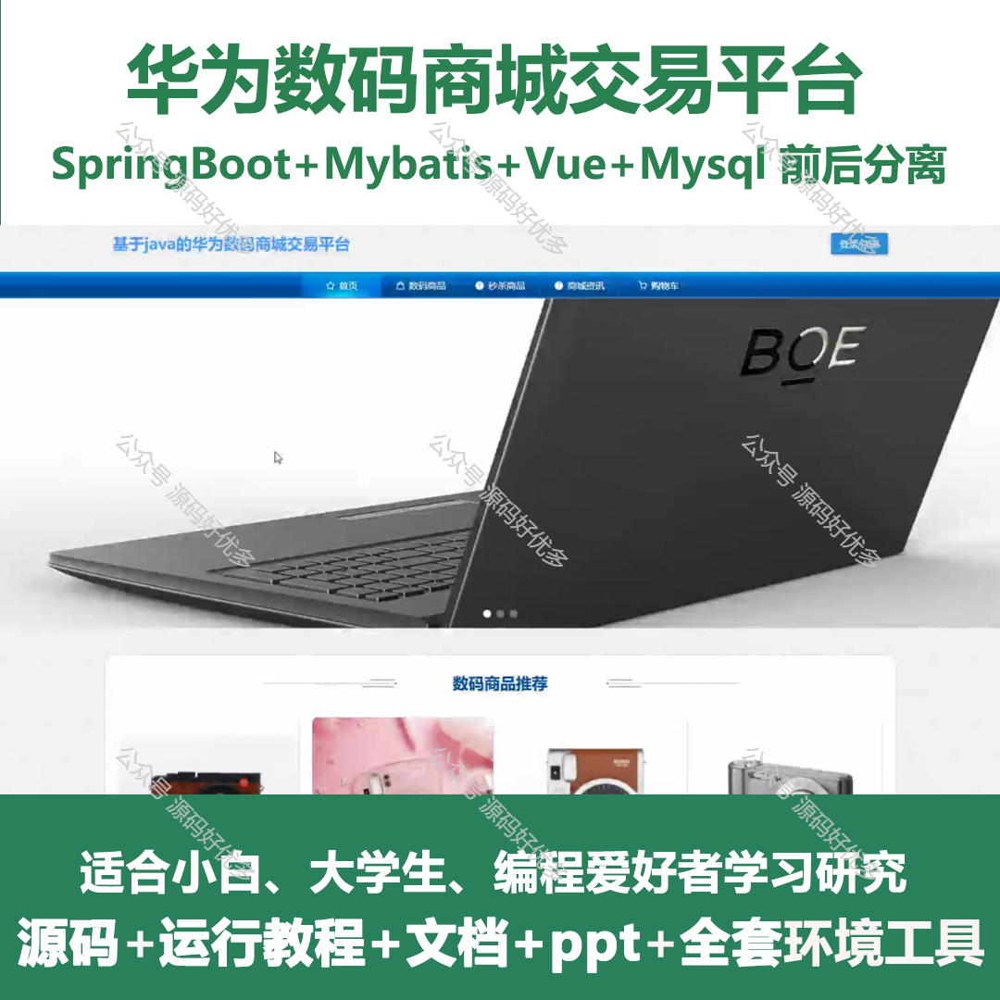
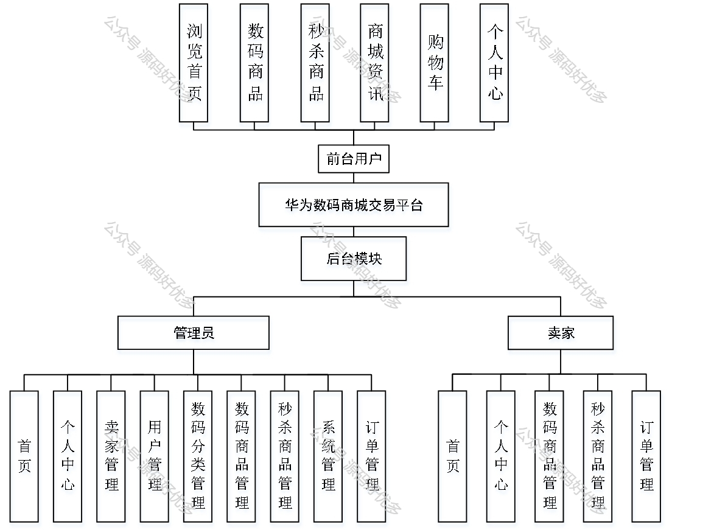
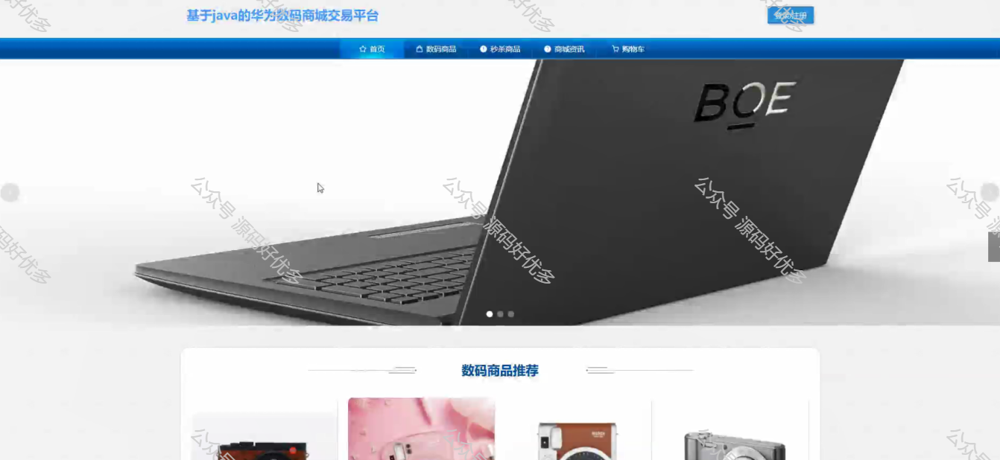
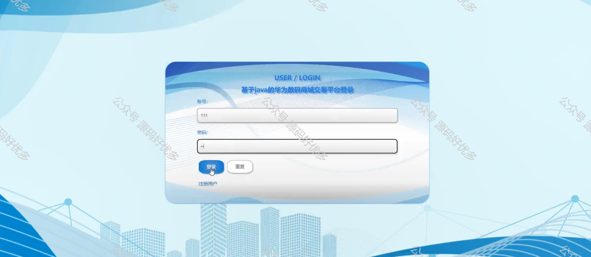
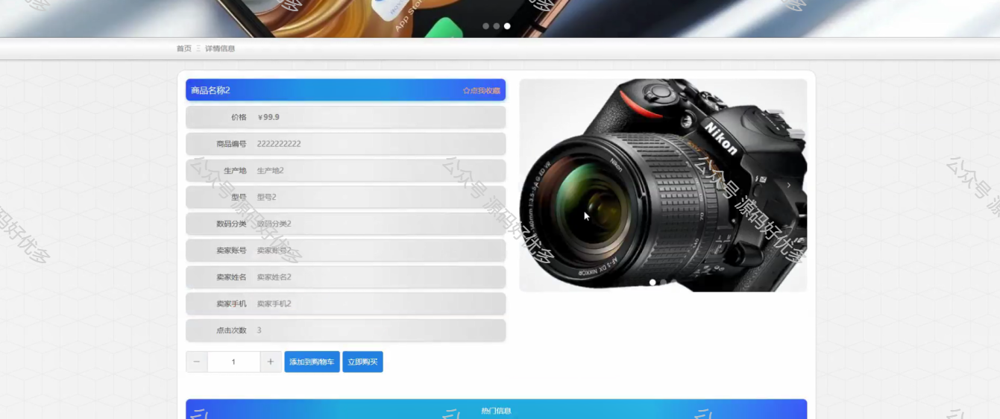
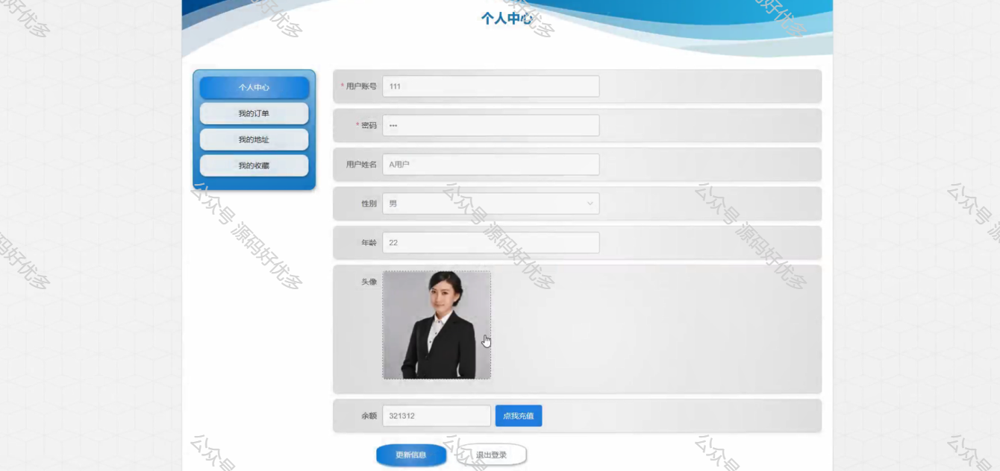
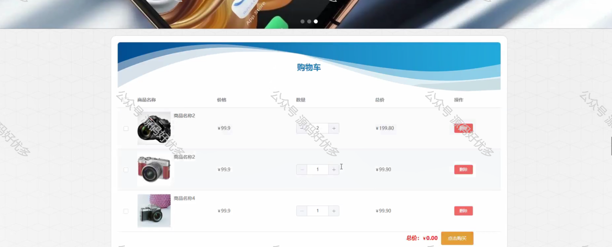
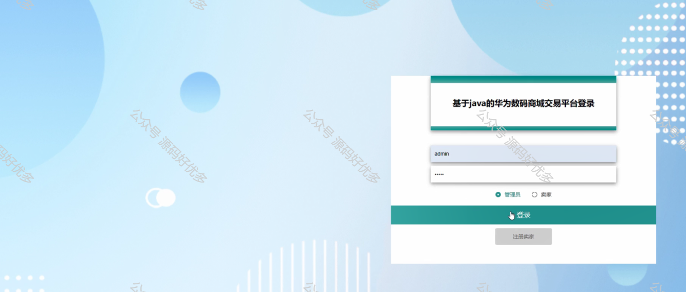
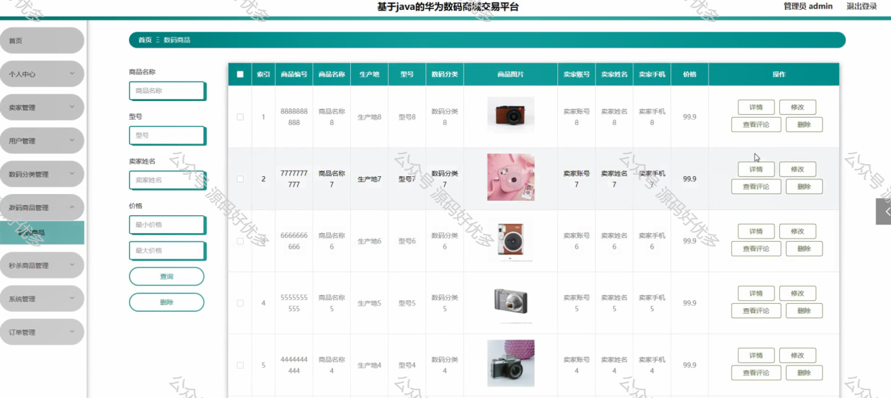
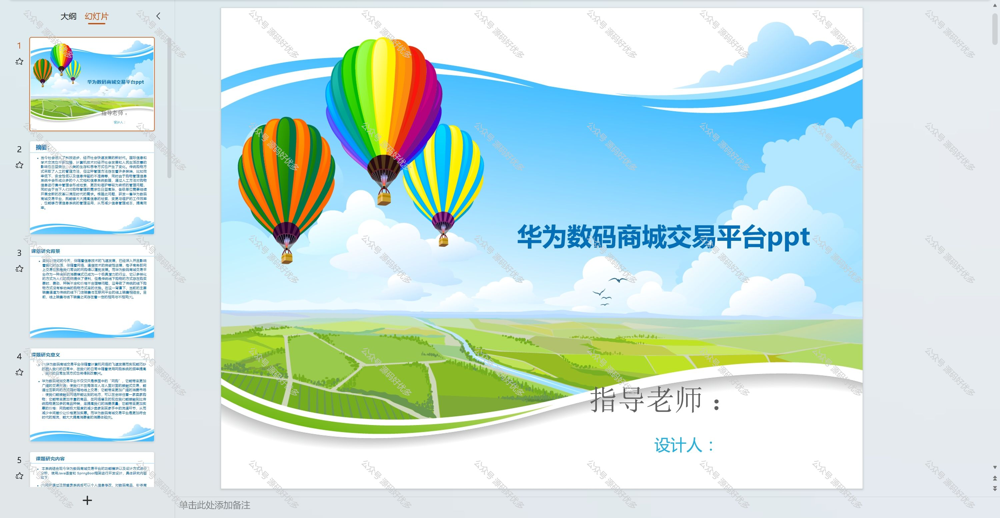
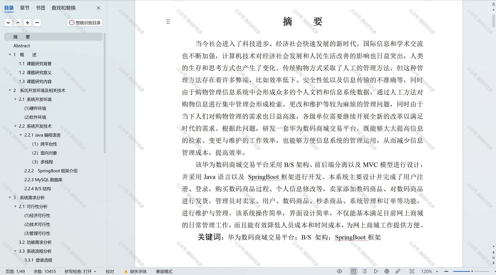

  
